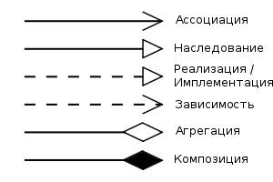

## C++ Class Relationships

* [Generalization] (Обобщение)
* [Binary Association] (Бинарная ассоциация)
* [N-ary Association] (N-арная ассоциация)
* [Aggregation] (Агрегация)
* [Composition] (Композиция)
* [Addiction] (Зависимость)
* [Implementation] (Реализация)

### References

* [Class Relationships]

[Class Relationships]: https://habr.com/post/150041/

[Generalization]: https://github.com/AlvinGames/class-relationships-cpp/tree/master/1%20Generalization
[Binary Association]: https://github.com/AlvinGames/class-relationships-cpp/tree/master/2%20Binary%20Association
[N-ary Association]: https://github.com/AlvinGames/class-relationships-cpp/tree/master/3%20N-ary%20Association
[Aggregation]: https://github.com/AlvinGames/class-relationships-cpp/tree/master/4%20Aggregation
[Composition]: https://github.com/AlvinGames/class-relationships-cpp/tree/master/5%20Composition
[Addiction]: https://github.com/AlvinGames/class-relationships-cpp/tree/master/6%20Addiction
[Implementation]: https://github.com/AlvinGames/class-relationships-cpp/tree/master/7%20Implementation
